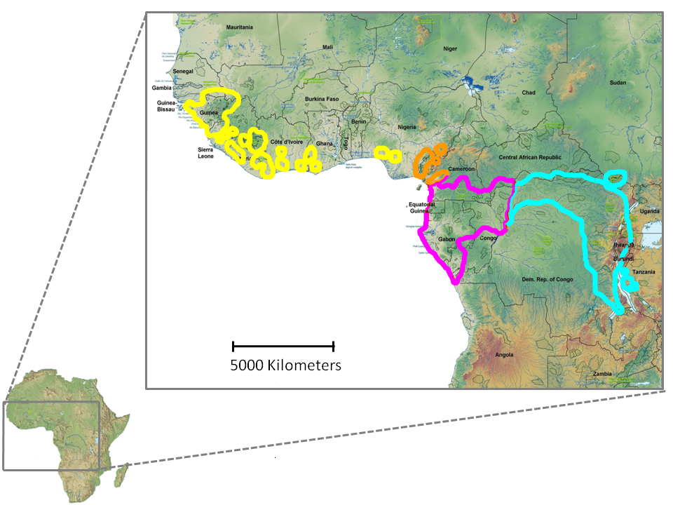

# Exercise in estimating nucleotide diversity
Casper-Emil Pedersen, Peter Frandsen and Hans R. Siegismund

### Program
* Examine the PLINK-format
* Read SNP data into R and extract information about the data
* Estimate nucleotide diversity (here as the expected heterozygosity) in different populations 
* Estimate the inbreeding coefficient for each individual in the different populations  
* Plot your results to graphically present the diversity in different population and in different regions along the chromosome

### Aim
* Get familiar with the commonly used PLINK-format
* Get familiar with extraction of simple summary statistics of data in R
* Get familiar with representation of results
* Be able to interpret diversity measures in populations

### Recommended background reading
See [Prado-Martinez et al. 2013](http://www.nature.com/nature/journal/v499/n7459/full/nature12228.html) for a comprehensive 
great ape paper

### Genetic Diversity in Chimpanzees
During this exercise you will be introduced to population genetic analysis of SNP data. The datasets used here consist of the 
variable sites found on chromosome 22 in chimpanzees. The data set contains genotypes from all four subspecies of chimpanzee 
(_Pan troglodytes_, see Figure 1), two human populations, one individual with European ancestry (CEU) and one individual with
African ancestry (YRI). The data has been filtered to reduce the size of your working data set and includes only SNP’s with 
exactly two different bases (bi-allelic).


__Figure 1 | Geographical distribution ranges for the _Pan troglodytes_ subspecies.__ The range borders of each subspecies; 
yellow for _Pan troglodytes_ verus (western chimpanzee), orange for _Pan troglodytes ellioti_ (Nigerian-Cameroon chimpanzee),
pink for _Pan troglodytes troglodytes_ (central chimpanzee), and blue for _Pan troglodytes schweinfurthii_ (eastern chimpanzee).
Reprint from [http://www.unep.org/grasp/](http://www.unep.org/grasp/) modified by C. Hvilsom. 

*Q1*: Before we get started, why do you think we chose chromosome 22?

>Chromosome 22 was chosen because it is one of the smallest somatic chromosomes. We would not be able to complete this exercise if we had chosen whole genomes or even one of the largest chromosomes.</span>


### Getting started

Change the directory to the exercise directory and copy your data:
```
cd ~/exercises
cp ~/groupdirs/SCIENCE-BIO-Popgen_Course/exercises/apeDiversity/apeGenDiv.tar.gz 
tar -zxvf apeGenDiv.tar.gz  
rm apeGenDiv.tar.gz
cd apeDiversity
```

Now you have all the data in the correct folder so you can proceed to the exercise but first, have a look at the different files and the file format.

The __PLINK__ format was originally designed for genotype/phenotype data analyses in association studies but also has a range of features applicable to other disciplines within population genetics. The two main __PLINK files__ are the _MAP_ and the _PED_ files, which often serves as the starting point for any analysis in PLINK. These two files are the standard output from a file conversion from another widely used file format, the __Variant Call Format (VCF)__. Many large-scale genome studies, like the 1000 genome project, use the _VCF_ format when they publish their data. This format holds all the information about the variant call (e.g. ‘read-depth’, ‘quality’).  A large range of analyses can be handled with tools designed for the _VCF_ format but most often, this toolset only serves to apply a number of standard filters, while downstream analysis are performed in other formats, like PLINK.

In concert, the _MAP_ and _PED_ files contains a bi-allelic extraction of the genotype information from the _VCF_. The two files are structured slightly different but together, they hold information about each called variant or SNP in each genotyped individual.

#### PLINK Flat files (MAP/PED)

Copy from [“Genome Wide Association Study pipeline (GWASpi)”](http://www.gwaspi.org/?page_id=145)

PLINK is a very widely used application for analyzing genotypic data. It can be considered the “de-facto” standard of the field, although newer formats are starting to be widespread as well.

The standard PLINK fromat provides sufficient information for a straight-forward association study. You may use the sex and affection fields for GWASpi to perform GWS studies. 

##### MAP files

The fields in a MAP file are:

* Chromosome
* Marker ID
* Genetic distance
* Physical position


__Example of a MAP file of the standard PLINK format:__

|  |  |  |  |
|:--:|:----------:|:-:|-------|
| 21 | rs11511647 | 0 | 26765 |
|  X |  rs3883674 | 0 | 32380 |
|  X | rs12218882 | 0 | 48172 |
|  9 | rs10904045 | 0 | 48426 |
| 9  | rs10751931 | 0 | 49949 |
| 8  | rs11252127 | 0 | 52087 |
| 10 | rs12775203 | 0 | 52277 |
| 8  | rs12255619 | 0 | 52481 |

__(Note: We do not have information about the physical map (Genetic distance – in centiMorgans) for the data used in this exercise)__
